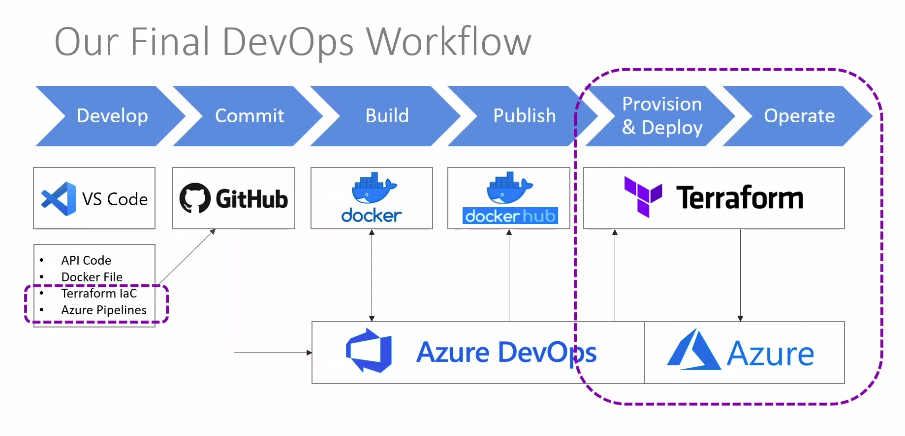

# TerraForm Samples

So we a covering:

* Overview

* Value of IaC

* Tooling

* API, Docker & git

* TerraForm 

* Azure DevOps

## All covered as the images shows



# IaC - Infraestructure as code

One of the most importante concepts into software development and operation, which brings the concept of DevOps out.

Important to nootice that we are materializing that here.

$$\   $$\ $$$$$$$$\ $$$$$$\  $$$$$$\ $$\     $$\ 
$$ | $$  |$$  _____|\_$$  _|$$  __$$\\$$\   $$  |
$$ |$$  / $$ |        $$ |  $$ /  \__|\$$\ $$  / 
$$$$$  /  $$$$$\      $$ |  \$$$$$$\   \$$$$  /  
$$  $$<   $$  __|     $$ |   \____$$\   \$$  /   
$$ |\$$\  $$ |        $$ |  $$\   $$ |   $$ |    
$$ | \$$\ $$$$$$$$\ $$$$$$\ \$$$$$$  |   $$ |    
\__|  \__|\________|\______| \______/    \__|


# First steps 

* 1 - Build the project we're using with

`dotnet create webapi Lubby` 

* 2 - So write the Dockerfile to build with the aspnet version.

Importante to notice that the ENTRYPOINT has to be the outputed dll file from the `dotnet build` command. So, after `cd Lubby` you could:

`sudo docker build -t keisynkk/lubby .`

If you face an error "is docker running" try:

`systemctl start docker`

Than the 11 stepts are related with the Dockerfile on Lubby folder. You can see your image with:

`sudo docker image ls`

the one you'll like is: 

REPOSITORY | TAG | IMAGE ID | CREATED | SIZE |
---------- | --- | -------- | ------- | ---- |
keisynkk/lubby | latest | b973c8a48ade | 14 min ago | 211MB |

Now, it's possible to test running again with a container:

`docker run -p 8080:80 keisynkk/lubby`

Hopefully it worked, so you have, now a container able to be deploied on Docker hub with

`docker push keisynkk/lubby`

If you got access denied, and you're using docker with sudo before the commands, you'll have to login with sudo, as well:

`docker login -u “myusername” -p “mypassword” docker.io`

Then, try push again.


# TerraForm


When you set up your cloud you might use some GUI provided by the company you trust your infrastructure as a service to. However, you'll have a hard time re-building or duplicating the same evironment if you want to. And it's even worse when you're building the same infrastructure in a diferente cloud platform.
That's where TerraForm comes handy. You can write everything in a shared framework and easily controll your cloud evolution and your company growth while migrating between clouds.

## What is TerraForm?

Terraform is actually an open source tool that provisions and manages cloud infrastructure, representing almost any type as a resource. That works with providers with all major clouds and  uses HCL or json.

### HCL - HashCorp Language

That's how we can write our infrastucture and use IaC. You can use json if you want to.

## How does it work?

Each cloud will communicate through a Provider that translates TerraForm code into infrastructure.

# Let's use it!

We first create define and create the provider and then the resources. 

After that, while logged into azure using azure cli you can expect to use terraform commands to apply the resources to azure.

`terraform init` 

Here, the .terraform folder is created and the plugin added to your project to enable terraform usability.

So, if we want to create a plan:

`terraform plan`

And if we want to apply it on azure:

`terraform apply`

# Creating Container resource

Now we can use the following comands to create our container resource


# Service Principal Environment Variables

* ARM_CLIENT_ID

* ARM_CLIENT_SECRET - PASS

* ARM_TENANT_ID

* ARM_SUBSCRIPTION_ID

With those values we can configure Terraform and talk algotirimically to azure.

!!!Sensitive information is store. CAREFULL!!

# Azure Active Directory 162124


We can create this active connection between azure and Terraform, using Azure Active Directory service provided by Azure.


Creating a App Registration for our resource, we can find directely the Tenant and Client Id's. Then, we can click on Certificate & Secrets to create the actual Secret password.

After that, with all mentioned variables set.

# Azure DevOps

With Azure DevOps, after creating an account private or public dependently to the Docker Hub repo, we can go straight to Service Connection in other do access both Docker Hub and Azure.

1 - Go to Project Setting > Service Connecctions and create one.

2 - Select the Docker Registry giving your docker hub login

3 -  connect to Azure Resource Manager then Service principal pull back the subscription and hust give it a service name.

4 - Create a pipeline and select the proper Repository. Select Docker Validate and Configure and edit the pipeline as needed

    In this case we add a diferent task > so build or push docker images > use container registry and then container repository using the docker hub repository

5 - After the task is added and well configured we can commit to Github again and run (Save and run)

Then, once it's commited the pipeline is going to connect our Dockefile image to Docker hub and run into azure pipelines with a report. It's important to notice that the tag number is gonna change every tim eyou run again

# Adding TerraForm

So to include Terraform to the mix, we go to Library on Azure DevOps to create a new variable group. So we set all the previously set variables for Terraform access

## Terraform important files

### Main.tf

    * Holds Terrform configuration code (Terraform Plan)

### Terraform.tfvars

    * We will use variables, but place them in main.tf

### Terraform.tfstate

    * JSON file managed by TerraForm

    * Used to map plan resources to running resources

    * Need to persist when it comes to a CI/CD Pipeline

In order to persist the info about Pipelines we have to use a storage:

# Storage for Pipelines

We want to set up a storage for our Pipelines: so we're gonna create a resource group, a storage account (we're using the blob), we're going to need a container and we specify the file name on main.tf.

## Create a new resourcer group

Create terraform-blobstore resource group in the location.

## Create Storage Account

So create a new storage Account within the just created resource group: uuditerraformstorage.

## Create a Container

Add a new container for the storage. Go to the storage resource just created and click on containers to create uuditfstate.

Now we basically want to use the details to configure our backend to store the state file. So we add: 

```javascript
terraform {
    backend "azurerm" {
      resource_group_name   = "terraform-blobstore"
      storage_account_name  = "uuditerraformstorage"
      container_name        = "uuditfstate"
      key                   = "terraform.tfstate"
    }
}
```

# Go back to Pipeline yaml

